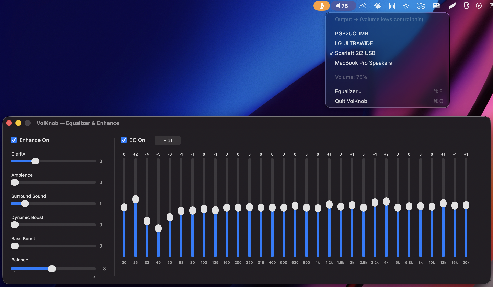
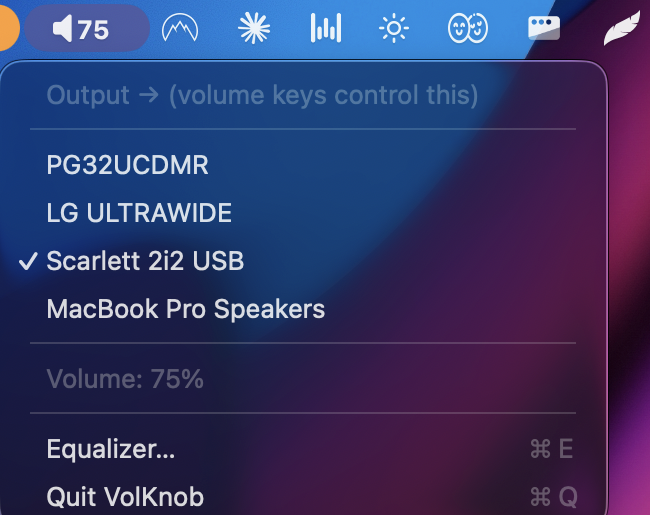
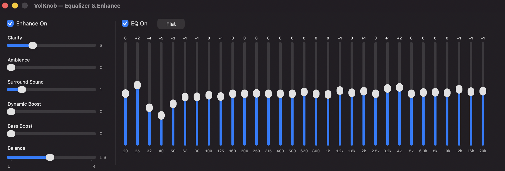

<div align="center">

# 🔊 VolKnob

### Your Mac's volume keys, working on *any* output — plus a 31-band EQ that makes everything sound better.

**Free. Open source. Tiny. Native.**

[](LICENSE)




</div>

---

## The problem

Plug a **Scarlett 2i2** — or most USB audio interfaces and DACs — into your Mac and your **volume keys stop working**. The device reports no software volume, so macOS greys the keys out (or quietly changes the built-in speakers instead). Your options were: reach for a physical knob, or pay **$50 for SoundSource**.

**VolKnob fixes it for free** — and throws in a proper equalizer while it's at it.

<div align="center">

</div>

## What you get

- 🎚️ **31-band graphic EQ** — the pro 1/3-octave standard (20 Hz → 20 kHz). Flipping it on is *night and day*.
- ✨ **Enhance suite** — **Bass**, **Clarity**, **Dynamic Boost**, **Ambience**, **Surround**. FxSound-style "everything just sounds better," in real time.
- ⌨️ **Volume keys on any output** — even hardware-only interfaces with no software volume. The keys control *your* device, not just the built-in speakers.
- 🔀 **Output switcher** — pick your speakers / interface / headphones from the menu bar in one click.
- 🪶 **Sleek & native** — a tiny menu-bar app. Auto-starts at login, restores your audio cleanly, sane defaults.
- 🆓 **Free & open source** — SoundSource is $50. This is $0.

<div align="center">

</div>

## Install

1. **[⬇ Download VolKnob-Installer.pkg](https://github.com/dertuman/volknob/releases/latest/download/VolKnob-Installer.pkg)**
2. Double-click it and click through. *(If macOS warns "unidentified developer," right-click the pkg → **Open**.)*
3. Approve the one-time **Accessibility** + **Microphone** prompts on first launch.

That's it — the installer bundles everything (including the [BlackHole](https://github.com/ExistentialAudio/BlackHole) audio driver) and sets VolKnob to start at login. No terminal required.

<details>
<summary>Build from source</summary>

```bash
swiftc -O -o volknob volknob.swift \
  -framework Cocoa -framework CoreAudio -framework CoreGraphics -framework ApplicationServices
```
Requires the free [BlackHole 2ch](https://github.com/ExistentialAudio/BlackHole) driver (`brew install blackhole-2ch`).
</details>

<details>
<summary>Reloading after changing the code (important!)</summary>

If VolKnob is already installed in `/Applications`, just run:

```bash
./reinstall.sh
```

Doing it by hand? The steps — and the one macOS gotcha — are:

```bash
# 1. compile (command above)
# 2. swap the binary into the installed app and re-sign
cp volknob /Applications/VolKnob.app/Contents/MacOS/volknob
codesign --force --deep -s - /Applications/VolKnob.app
# 3. clear the now-stale Accessibility grant   ← the step everyone misses
tccutil reset Accessibility com.volknob.app
# 4. restart the app
launchctl kickstart -k "gui/$(id -u)/com.volknob.app"
# 5. re-enable VolKnob in System Settings → Privacy & Security → Accessibility,
#    then repeat step 4 so the volume-key tap installs under the fresh grant
```

**Why step 3 exists:** the app is ad-hoc signed, so every rebuild produces a new code
signature. macOS ties the Accessibility permission (needed to intercept the volume keys)
to that signature — after a rebuild the old grant is dead, and *re-toggling the existing
checkbox does nothing* because the stored entry still points at the old signature. The
entry must be deleted (`tccutil reset`) and granted fresh. Symptom of skipping it: the app
runs and the menu-bar icon works, but the volume keys change BlackHole's own volume
(macOS HUD appears) instead of VolKnob's.
</details>

## How it works

System audio is routed through **BlackHole** (a free virtual audio driver) into VolKnob, which applies **volume → EQ → enhance** in real time and forwards the result to your chosen output. Clock drift between devices is handled by a CoreAudio **aggregate device**, so it stays glitch-free.

```
all system sound → BlackHole → VolKnob [volume · 31-band EQ · enhance] → your output
                                   ↑
                    volume keys / mouse wheel
```

## Tested with

- MacBook (Apple Silicon) + **Focusrite Scarlett 2i2 USB**
- Built-in speakers, external monitor audio, USB DACs

## Credits

- Audio routing powered by [**BlackHole**](https://github.com/ExistentialAudio/BlackHole) by Existential Audio (MIT).
- Inspired by [SoundSource](https://rogueamoeba.com/soundsource/) and [FxSound](https://www.fxsound.com/).

## License

[MIT](LICENSE) — do whatever you want with it.

<div align="center">

### ⭐ If VolKnob saved you $50, star the repo!

</div>
